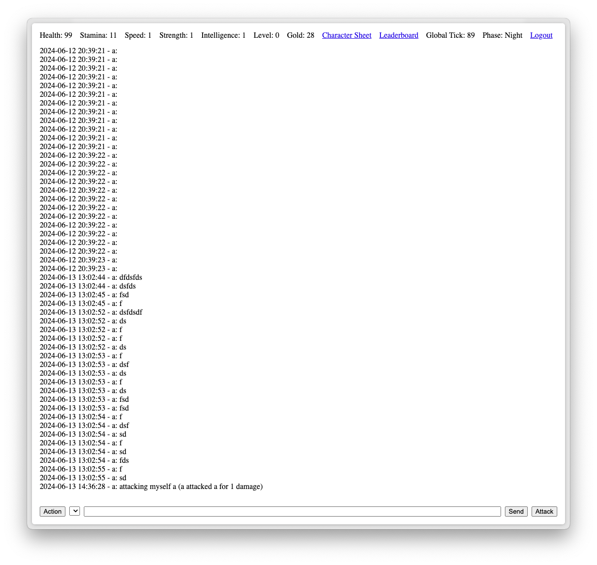

## News

> [!NOTE]
> Actively seeking contributors or PRs from interested parties

## High Priority

- [ ] Design basic class system/objects/database and class switching system
- [ ] Improve on global timekeeping (tick) system
- [ ] Figure out how to make stat allocation work
- [ ] Improve on chat input so attacks feel easier to perform
- [ ] Design basic items and figure out how to populate game with items
- [ ] Design per-class clicker interface
- [ ] Migrate to saner(?) development stack

## Log line

A multi-user messaging interface that facilitates roguelike-like interaction with the environment.

> [!CAUTION]
> Right now, in service to this game being in super development mode, it's making use of unencrypted database entries! Please do not create new accounts with sensitive or personal info. All messages sent in this chat software should be considered public!

## Why?

Basically I wanted to write up a really simple html-only chat interface where each member of the chat has RPG stats which are affected by certain types of posting. I have MMO-specific insights into the mechanics of "pre-social media" social internet, and have a sense that MMOs were really popular due to their being chatrooms with activities attached. As soon as chatrooms (and later, chat platforms... and later, social networks) and online text-based communication massively proliferated, one did not need to install a heavy game to get their socialization fix.

## Details

1. **World Systems**
	- Every individual message sent by a user is equivalent to a "tick" in the game environment. This a time model reminiscent of classic roguelikes, which themselves are derivatives of tabletop RPG turn-based combat. Most actions take a single tick to execute, but more complex, high-level, or involved actions take more ticks to execute.
	- A number of meta-mechanisms can be tied to the tick system
		- Day/night designation
		- Moon cycling
		- Seasons
		- Epochs
		- Magic casting
		- Status effects
		- etc.
	- Examples of systems that might require longer tick cycles to complete
		- Changing jobs takes longer tick times
		- Crafting materials/weapons/armor takes more ticks
		- Mining new dungeon rooms takes more ticks
2. **Player Systems**
	- Most core systems associated with individual players revolve around one's total message count
		- Sending lots of messages results in player attributes and overall level being incremented
		- Attaining random low-level amounts of in-game currency (gold) is triggered by sending messages
		- An individual's messages contribute to the world's "tick" incrementing, and thus player messages move the game forward in time
	- Players/users are granted a number of attributes, an inventory, a gold reserve, a class/job, and an overall level
		- A player's overall level is determined by the total number of messages they send. A few leveling systems are being experimented right now, but they all relate to some math set in relation to the total number of messages a user has sent. This property allows for a clear designation between people who has been active or around for a while, vs. noobs
		- As a player's total level is raised, they should be given an opportunity to allocate points across their attributes.
		- There is a low probability that certain types of posts or messages sent will increment an attribute by 1

			- Attacking players increases X

			- Using clicker skills increases X

			- Posting links increases X

			- Posting images increases X

			- Posting messages greater than 100ch increases X or decrements Y

			- Posting messages less than 20ch increases X or decrements Y

			- etc.

	- Players can adopt a number of classes or jobs which affect their attributes in minor ways, their clicker skills, and their general ability to mold/grow/extend the conversation environment or create items for other players
	- @-mentions (or username regex or something) can be used to perform actions on other characters
		- if you're a support-type character you should be able to heal or modify the stats of other characters, 
		- any attack on other characters should take into account a character's speed or defence and decrement the health of other members. 
		- If a member's health is decremented below a certain amount, they should be permenantly killed and added to a cemetery, or an underworld which is a separate chat. 

## Gameplay/Chat Mechanics

For all intents and purposes, the heart of this "game" is an ordinary chat interface. You can use it to talk to people and it should basically "just work" the way you expect it to.

Obviously, the systems built upon this foundation should intentionally get weird.

Every user of the RPGChat interface is granted Health/HP, which when depleted, results in their account being deleted. Any player can attack any other player at any time, so this chat interface is more or less "PVP" by default.

As mentioned, every post/message sent to the chat interface increments a global tick. Individually, posts equate to gaining EXP to increase one's level, so the more you chat in this space, the cooler/more strong/more able you become. At an extreme level disparity, higher-level people can kill off lower-level noobs very easily. This is intentional.

Note: We should probably introduce some idea of a separate chat room called "Beginner Island", where only low-level noobs can hang out in peace/safety.

## Classes

Classes can be changed at any time, some classes need to be unlocked or won during particular epochs when specific conditions are met. Classes set unique skills for the player, and varying mechanics that affect the shape of the environment, the gameplay itself, and the battle/exchange that happens within the game environment.

The class system is intentionally structured to promote chaotic/fun/unexpected gameplay, we're throwing out the classic Support/DPS/Tank trifecta in favor of something a little weirder and more flexible, sort of like FFXI in its heyday, or FFT/FFTA.

Classes should rely pretty heavily on particular stats to be effective, so that ruining or weakining a class is possible if stats are misallocated or "grown" incorrectly. I'm torn on whether respec should be possible or if you should just die/make another character.

In order to spice things up, each class can make use of unique abilities or energy meters linked to a "cookie clicker" (Warioware-inspired) style interface. For example: the Novice class is intentionally designed to maximize for obtaining lots of gold or items early one, while one is optimizing their build for another class. Their "cookie clicker" interface should facilitate manually grinding for EXP/Gold/Gacha drops. In contrast, the "Chemist" class revolves around Day/Night cycles in which their cookie clicker UI turns from crafting potions (Day) to building rage for attacking (Night). Ideally, each class has wildly differing mechanics to work with, in addition to basic actions like sending messages or generically attacking.

Class examples

- Dungeoneer
	- Can use clicker actions to gain abilities related to growing/extending/evolving the dungeon environment. Dungeon Energy must be expended in order to build or extend the dungeon. Perhaps a unique "salt" from the player is used to determine the flavor of dungeon elements they create.
	- Action List
		- Dig Sideways (Expand Dungeon with additional "rooms")
		- Dig Down (Expand depth of a single dungeon room
		- Discover Ruin (Generate scenario)
- Novice
	- Default class for first 5 levels. Can use clicker actions to accelerate overall Level incrementing as well as gain gold or items. Skills revolve around bootstrapping base stats/attributes for growth into other classes. Higher levels of "Novice" can obtain "Super Novice" skills.
	- Action List
		- Train (Gain experience)
		- Treasure Hunt (Gain gold or items
- Chemist
	- Hybrid damage/support class affected by the day/night cycle. During the day, chemists' clicker actions revolve around expending points for synthesizing consumable items. During the night, chemists become twisted by their self-experimentation, and clicker actions revolve around building up rage for higher damage/crit on normal attacks
	- Action List (Day)
		- Craft potion
	- Action List (Night)
		- Build rage
- Historian
	- A special class awarded to the user with the most posts during a particular epoch. Historians are able to set "grand systems" that affect the entire field of play. This can relate to leveling systems, probability rates for gold/item drops, enemy count, allowed jobs, and other unspecified/undetermined systems.
	- Liner note: This class is an in-joke about how people use pinning and renaming group chats for comedic effect. I'd like to think the Historian class is the embodiment of this sort of person.
	- Action List
		- Name age
		- Set difficulty
		- Storytell
		- Timeskip
		- Set weather
		- Set sound

## Distribution

on itch.io, during a roguelike event, whatever. Just doing this for fun!

## Infrastructure

Static site + SQLite database for now? Can get complex when core mechanics are encoded.

> [!WARNING]
> This repo is really jank, the absolute embodiment of AI yapslop. I apologize in advance for anyone who wants to help build this up.

It actually might be really interesting to consider how crypto incentives/mechanics might come into play here, only because I genuinely buy into the idea that crypto materiality can make for more "physical" gameplay, which is what I care most about. Crypto affordances could come into play relating to player creation, room creation, building creation, demon creation, or death (bones).

## References

1. Games
	- Warioware: Minigame clicker mechanics
	- Dark Souls: Atmosphere, level design, dark fantasy
	- Ogre Battle: Job/class system, leveling system, magic system
	- Shin Megami Tensei: Atmosphere, dungeon crawling, fusion system
	- Nethack: Turn-based gameplay
	- Final Fantasy 11: Job/class system, art, world design
	- Ragnarok Online: Job/class system, art, world design, leveling system
	- Diplomacy: Simplicity, metagaming, social play 
	- Neveron: Simplicity, fractal world, persistent world, turn-based gameplay, art
	- Materia System 
	- Sphere Grid
	- T1 Roleplay System
2. Links

- [T1 Combat Overview](https://aminoapps.com/c/roleplay-fight-club/page/item/overseers-t1-combat/DKGx_VNUNILoEqMXaQ8nRD3v43aneNbapr#:~:text=Tier%201%20or%20T%2D1,strategy%2C%20and%20knowledge%20of%20realism.)
- [T-Style Roleplay Terminology](https://theunofficialofficialrulesofroleplay.weebly.com/terminology-t1-t2-t3.html)
- [Rpedia Tumblr](https://rpedia.tumblr.com/post/22463407625/amp)
